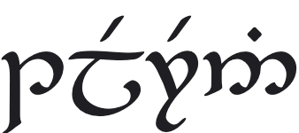

<p align="center"></p>
<h1 align="center">Telerin</h1>
<p align="center"><a href="https://npmjs.com/package/telerin"></a></p>

Terminal/tileset renderer for web based games.

* Configuration: [`constructor`](#constructor) [`codepage`](#codepage), [`scale`](#scale)
* State: [`layer`](#layer), [`color`](#color), [`background`](#background)
* Methods: [`clear`](#clear), [`clearLayer`](#clearLayer), [`clip`](#clip), [`put`](#put), [`write`](#write), [`box`](#box), [`refresh`](#refresh), [`screenToGrid`](#screenToGrid)

## Example

```ts
import { Terminal } from "telerin";

let term = new Terminal(20, 20);
term.color = "red";
term.background = "#0000FF";
term.put(0, 0, 0x10);
term.write(10, 10, "Hello world");
term.refresh();

// Make the canvas visible
document.body.append(term.canvas);
```

## constructor
Creates a new terminal instance with a size in rows and columns.

```ts
new Terminal(20, 20);
```

To use a custom font/tileset pass the url and cell width/height.

```ts
new Terminal(20, 20, "mytiles.png", 16, 16);
```

## codepage
By default the terminal uses CP437 for character mapping. Use the `codepage` property to setup an alternative map.

```ts
// Map char code 20 to char code 1
terminal.codepage = { 20: 1 };
```

## scale
Resize the canvas to render at a larger scale.

```ts
// Render the canvas twice as big
terminal.scale(2);
```

## layer
Set the current layer index.

```ts
terminal.layer = 3;
```

## color
Sets the foreground color for subsequent drawing functions to use.

```ts
terminal.color = "red";
terminal.color = "#FF0000";
terminal.color = "rgb(255, 0, 0)";
terminal.color = "hsl(0, 50%, 50%)";

// Tiles will be drawn in their original colors
terminal.color = undefined;
```

## background
Sets the background color for subsequent drawing functions to use.

```ts
terminal.background = "red";
terminal.background = "#FF0000";
terminal.background = "rgb(255, 0, 0)";
terminal.background = "hsl(0, 50%, 50%)";

// Tiles will be drawn without a background color
terminal.color = undefined;
```

## clear
Clears the contents of all layers.

```ts
terminal.clear();
```

## clearLayer
Clears the contents of the current layer.

```ts
terminal.clearLayer();
```

## clip
Sets the clipping rectangle for the current layer.

```ts
// Clips content outside of a 3x4 rect at 1,2
terminal.clip(1, 2, 3, 4)

// Reset the clip area for the current layer
terminal.clip();
```

## put
Puts a character code into a cell.

```ts
terminal.put(0, 0, 40);
terminal.put(0, 0, "@".charCodeAt(0));
```

Also supports passing an offset in pixels.

```ts
terminal.put(0, 0, 40, 3, -3);
```

## write
Write a string of text.

```ts
terminal.write(0, 0, "Hello, world!");
```

Respects linebreaks, but does no wrapping.

## box
Draws a box.

```ts
// Draws a 3x4 box at 1,2 using the default box drawing characters
terminal.write(1, 2, 3, 4);
// Using a custom set of box drawing characters
terminal.write(1, 2, 3, 4, "┌┐└┘─│");
```

## refresh
Draws the contents of the terminal to the canvas.

```ts
terminal.refresh();
```

## screenToGrid
Converts a point on the screen to terminal grid coordinates.

```ts
onmousemove = event => {
  let { x, y } = terminal.screenToGrid(event.x, event.y);
  // x, y are rounded grid coordinates
}
```